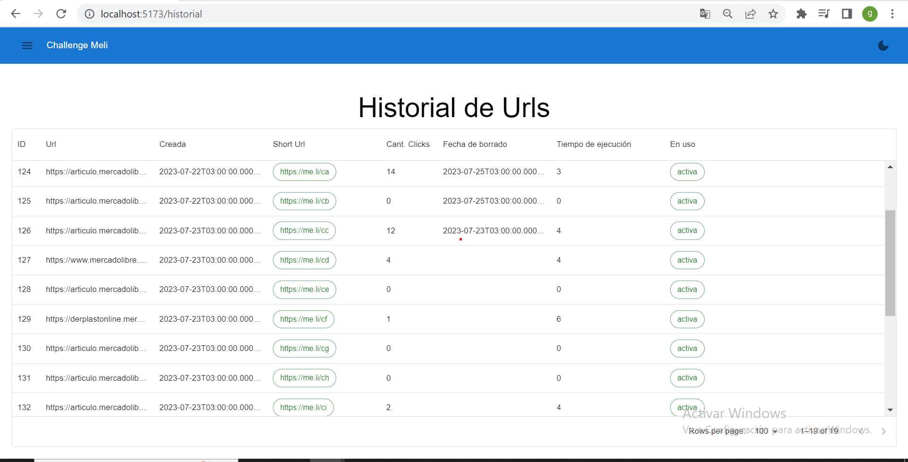
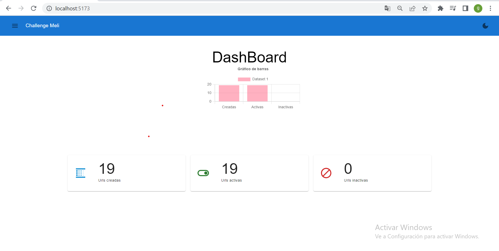
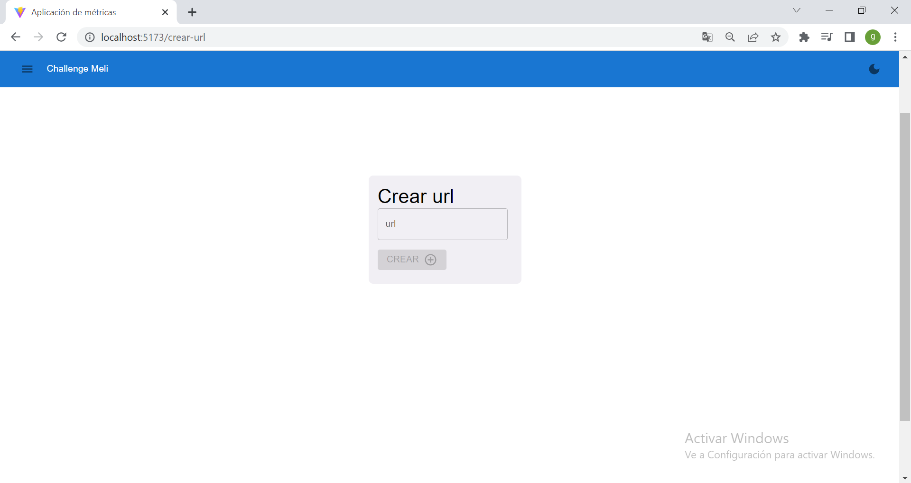
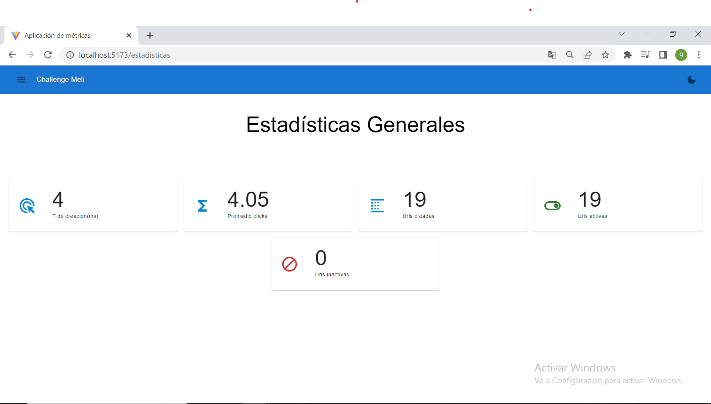
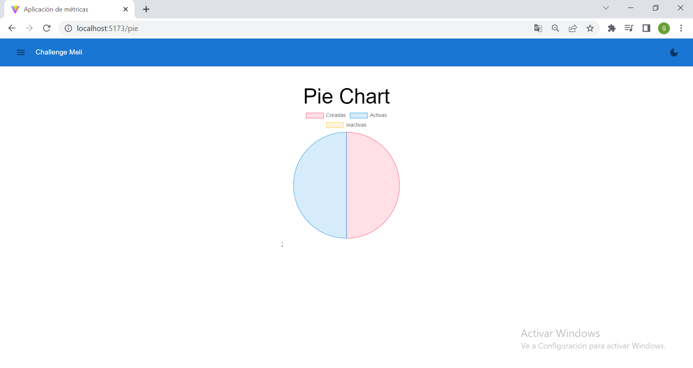
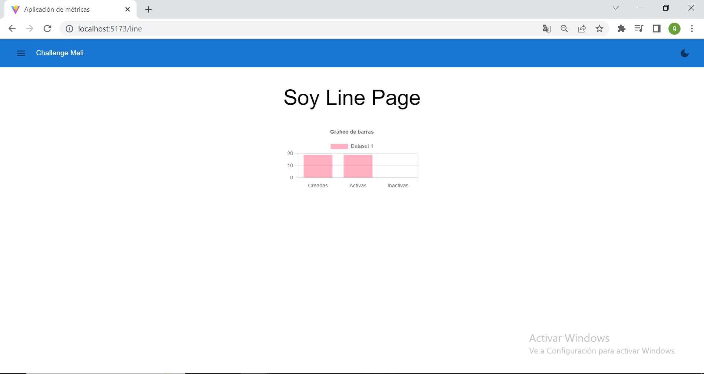

# Challenge MercadoLibre (front-end) 

## Tecnolgías utilizadas: 
* __React:__ 

Es una librería de uso extendido basada en componentes para la  construcción de interfaces de usuario. Su eficiente manipulación del DOM la convierte en una opcíon fuerte a la hora de desarrollar aplicaciones front-end. 

* __TypeScript:__  

 Es un superset de JavaScript que agrega tipos estáticos a la sintaxis de JavaScript. Esta optimización de tipados proporciona una mayor robustez y ayuda a detectar errores en tiempo de compilación, haciendo más ágil el mantenimiento .

* __Material UI:__ 

Es una popular biblioteca de componentes de diseño para React que utiliza los principios de diseño de Material Design de Google. Proporciona muchos componentes estilizados y personalizables para el desarrollo de una interfaz de usuario atractiva y coherente.
* __Redux ToolKit Query:__  

Es una librería de Redux que simplifica su configuración y nos brinda un conjunto de herramientas para trabajar con la gestión del estado de nuestra aplicación.  RTK Query es una extensión de RTK para el manejo de solicitudes HTTP y el almacenamiento en caché, gestionando el estado de datos de manera más eficiente. 

* __React Testing Library:__   

Jest es un framework de pruebas para JavaScript, y React Testing Library  permite escribir pruebas para componentes de React de manera sencilla y legible. Juntos, Jest y React Testing Library ofrecen una muy buena experiencia para probar componentes. 

* __React Router v6:__ 
  React Router es una biblioteca de enrutamiento para React que gestiona la navegación y las rutas en tu aplicación de una manera declarativa. 


* __Vite:__ 
 Entorno de desarrollo ultrarrápido centrado en la velocidad de construcción y el tiempo de ejecución. 

# __Para levantar el proyecto:__  

Se debe tener Nodejs instalado con anterioridad. 


### Clonar el  repositorio 

```
git clone <url_del_repo> 

``` 

### Ir al directorio de la carpeta donde fue creado: 


```
cd <nombre_de_la_carpeta>

``` 

### Instalar las dependencias del proyecto. 


```
yarn 

``` 

### Poner en marcha el proyecto: 

Abrir terminal y ejecutar: 


```
yarn dev 

```  
### Ejecutar pruebas 

```
yarn test

```

### Vistas 


* __Historial__ 



* __DashBoard__  


* __Crear Url__ 



* __Métricas__ 



* __Pie Chart__ 



* __Bar Chart__ 




